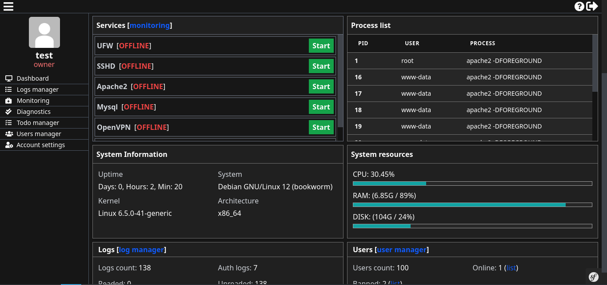

# <h1 align="center">Admin suite</h1>
### 
Solution for administration and monitoring linux private servers

    <a href="https://github.com/lordbecvold/admin-suite/blob/main/DOC.MD" target="_blank">Documentation</a> |
    <a href="https://github.com/lordbecvold/admin-suite/blob/main/LICENSE" target="_blank">License</a> |
    <a href="https://becvar.xyz" target="_blank">Author</a>

## Dashboard preview

## ROADMAP
### 1.6
- [ ] Internal chat component
    - [ ] Basic chat room
    - [ ] Display usernames & profile pictures
    - [ ] Link higlightin
    - [ ] Chat test
### 1.7
- [ ] Refactoring
    - [ ] Add response codes to all controllers returns
    - [ ] Save return to variable before return
    - [ ] Better names for methods & variables
    - [ ] Better HTML/TWIG structure
    - [ ] Log level int in object const     
- [ ] Doc/About & download page (github pages)
    - [ ] About homepage
    - [ ] Download page
    - [ ] Base documentation
    - [ ] Installation documentation
    - [ ] Components documentation
### 1.8
- [ ] Terminal component
    - [ ] Simple command execution
    - [ ] Interactive command execution
    - [ ] MySQL CLI
### 1.9
- [ ] File browser & editor
    - [ ] List files in filesystem
    - [ ] Rename files
    - [ ] Remove files
    - [ ] Move files
    - [ ] Open files in txt editor

## Primary use
I created this project to manage my personal servers. I wanted a simple and easy-to-use solution that would allow me to monitor and manage my servers without relying on complex software or complicated setups. This project aims to manage single server instances, not clusters.

## Contributing
Contributions are welcome! Please fork this repository and submit pull requests for any features, bug fixes, or enhancements. If you have any questions or need help, feel free to open an issue or contact me directly.

## Dependencies
This project uses the following technologies
* PHP
    * [Website](https://php.net)
* Symfony
    * [Website](https://symfony.com)
* Tailwind
    * [Website](https://tailwindcss.com)
* NPM / Webpack encore
    * [NPM](https://docs.npmjs.com)
    * [Encore](https://symfony.com/doc/current/frontend/encore/index.html)

## License
The framework is open-sourced software licensed under the [MIT license](https://github.com/lordbecvold/admin-suite/blob/main/LICENSE).
